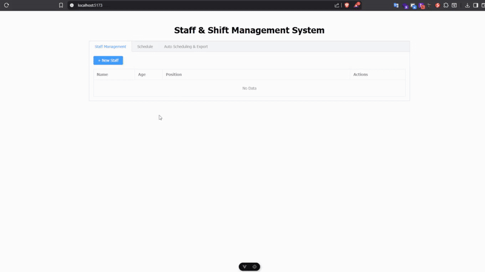
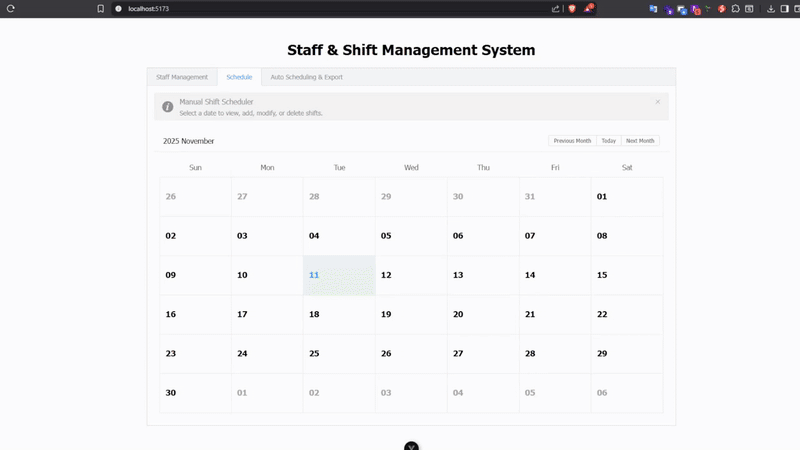
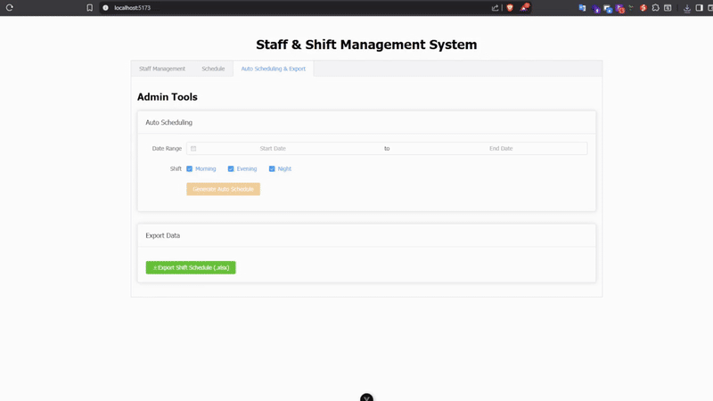
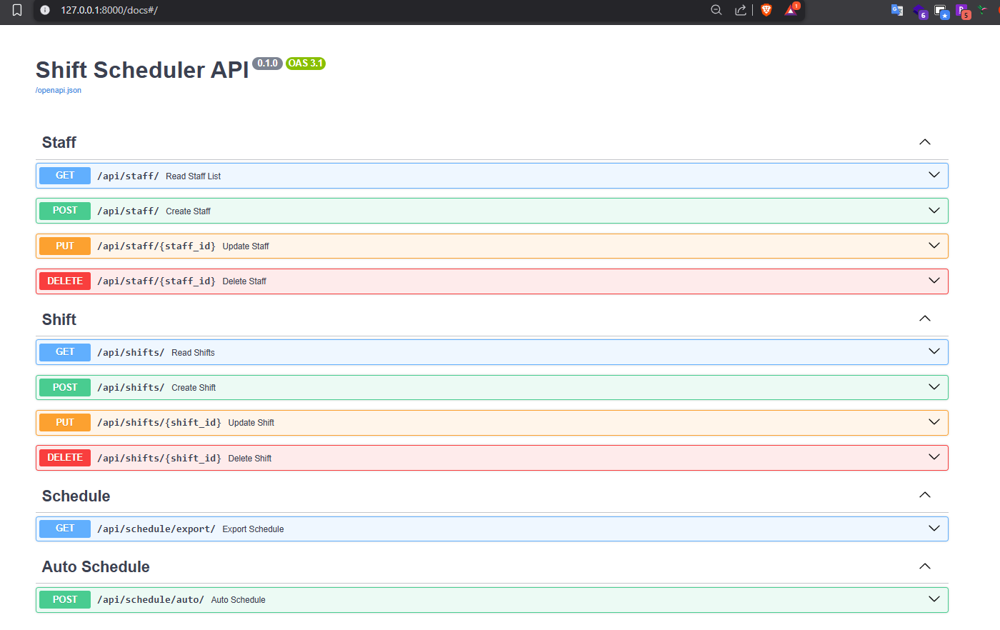

# Staff & Shift Management System

A full‑stack web application for managing staff data and generating/tracking work schedules.

Backend is built with Python + FastAPI and SQLAlchemy.  
Frontend uses Vue 3 + Element Plus.

## Features
- CRUD for staff records (name, role, contact, active/inactive — soft delete)
- Shift generation and manual shift assignment
- Work schedule export (Excel)
- Responsive Vue 3 admin UI

## Tech stack
- Backend: Python, FastAPI, SQLAlchemy, Uvicorn, Pandas + openpyxl (Excel export)
- Frontend: Vue 3, Vite, Element Plus
- Database: SQLite (development)

## Prerequisites
- Python 3.9+
- Node.js 16+ and npm (or pnpm/yarn)
- Git

## Repo layout
- backend/        — FastAPI app, models, API routes
- frontend/       — Vue 3 frontend app
- README.md

## Run guide

Follow these steps to set up and run the application locally.

### 1. Clone the repository
```bash
git clone https://github.com/StefanKhor/SSMS.git
cd SSMS
```

### 2. Backend setup & launch (FastAPI)
Navigate to the backend directory and create a virtual environment.

```bash
cd backend

# Create virtual environment
python -m venv venv

# Activate on Windows (Command Prompt / PowerShell)
# Command Prompt
.\venv\Scripts\activate
# PowerShell
# .\venv\Scripts\Activate.ps1

# Activate on macOS / Linux
source venv/bin/activate
```

Install dependencies:

```bash
pip install -r requirements.txt
```

Start the development server:

```bash
uvicorn main:app --reload
```

The API will be available at: http://127.0.0.1:8000

The Swagger UI will be available at: http://127.0.0.1:8000/docs

### 3. Frontend setup & launch (Vue 3)
Open a new terminal, navigate to the frontend directory and install dependencies:

```bash
cd frontend
npm install
# or
# yarn install
# pnpm install
```

Start the development server:

```bash
npm run dev
# or
# yarn dev
# pnpm dev
```

The frontend will be available at: http://localhost:5173

## Notes
- Ensure the backend URL in the frontend config matches the running FastAPI server.
- For production deployments, environment variables, and a persistent database should be implemented.

# Demo
1. Staff Management


2. Manual Schedule Arrangement


3. Auto Scheduling


4. Export Schedule as Excel file


5. Swagger UI API Overview
